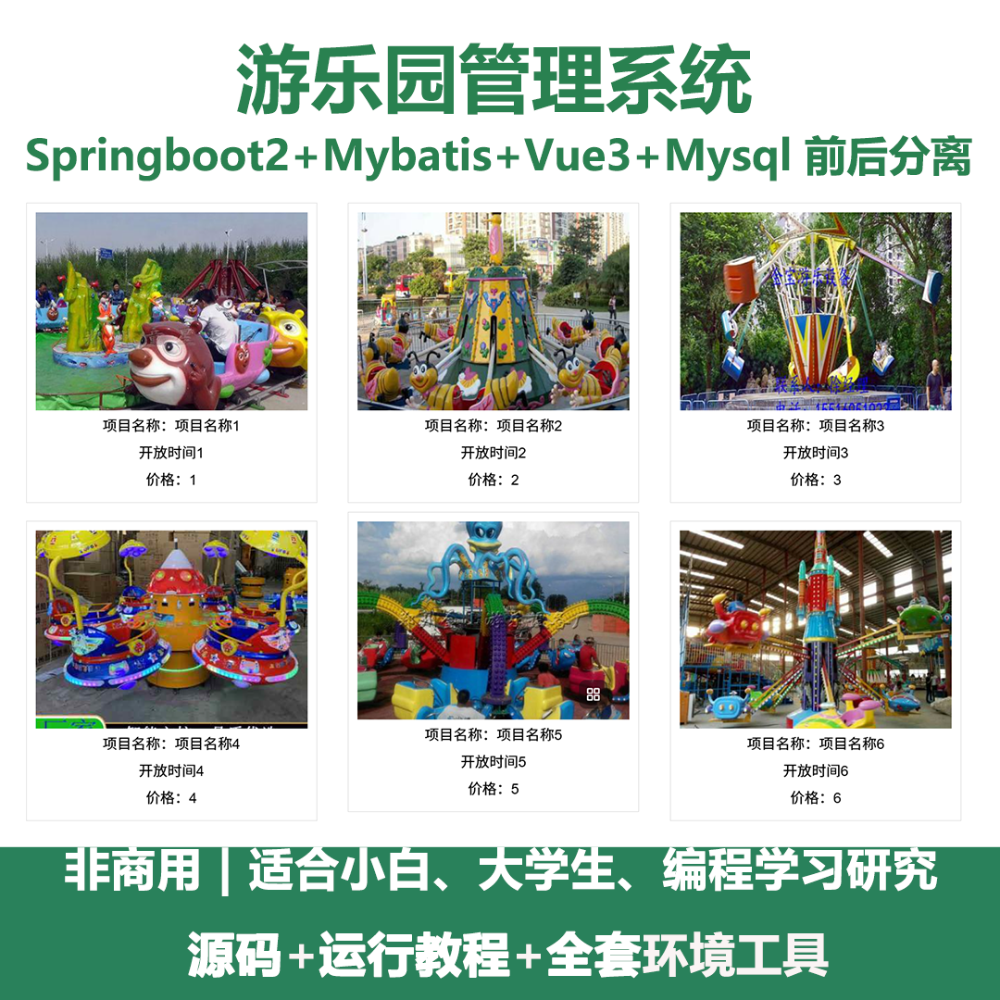
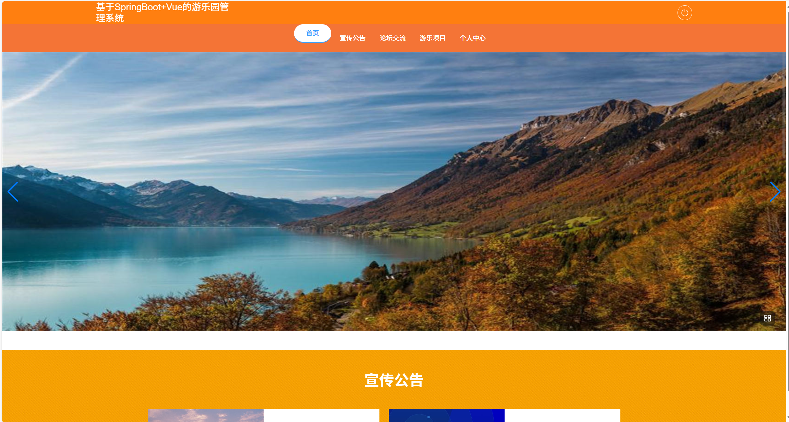
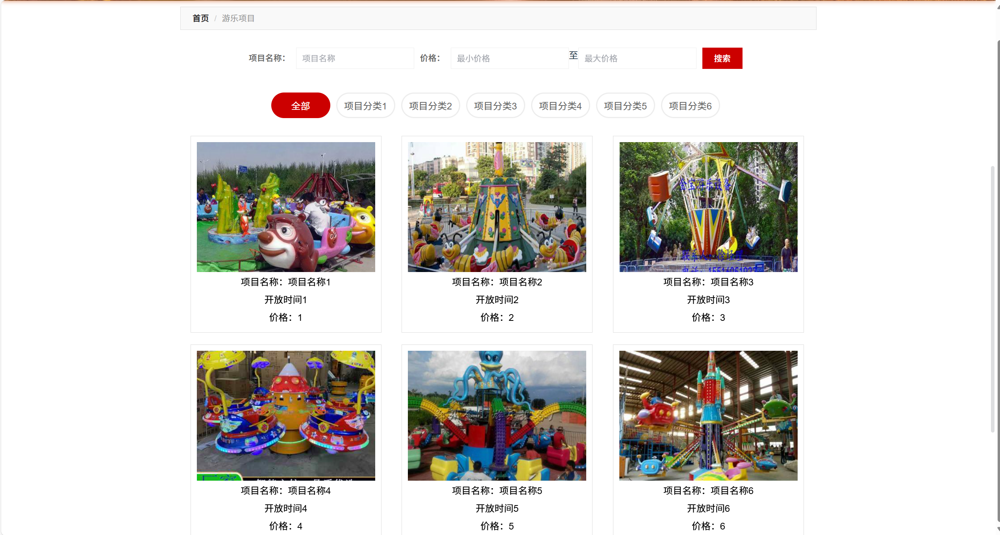
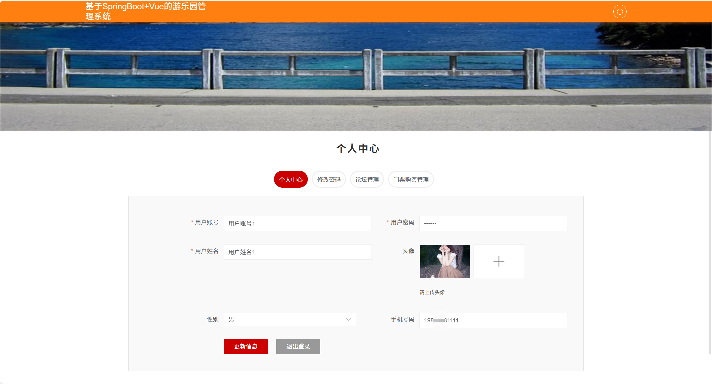
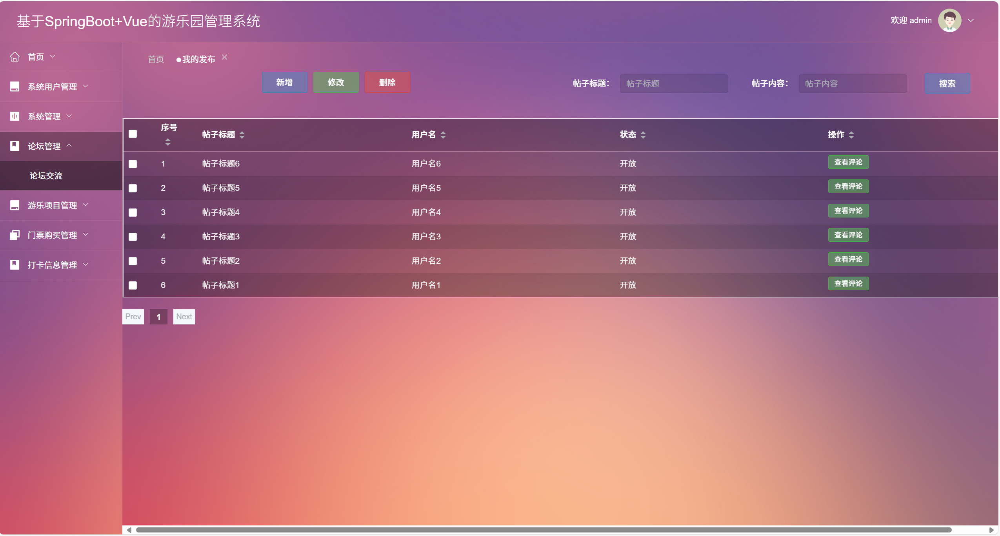
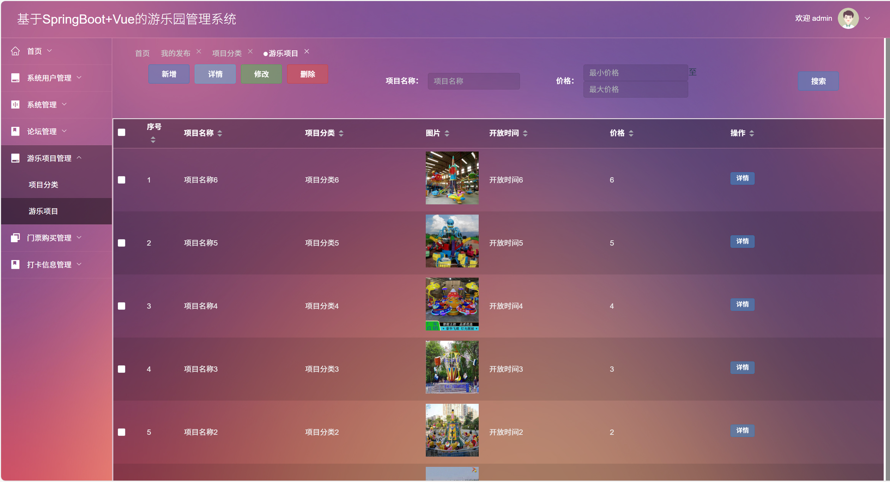
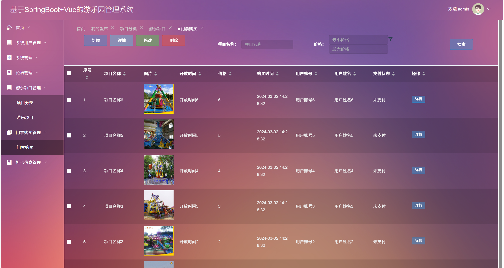
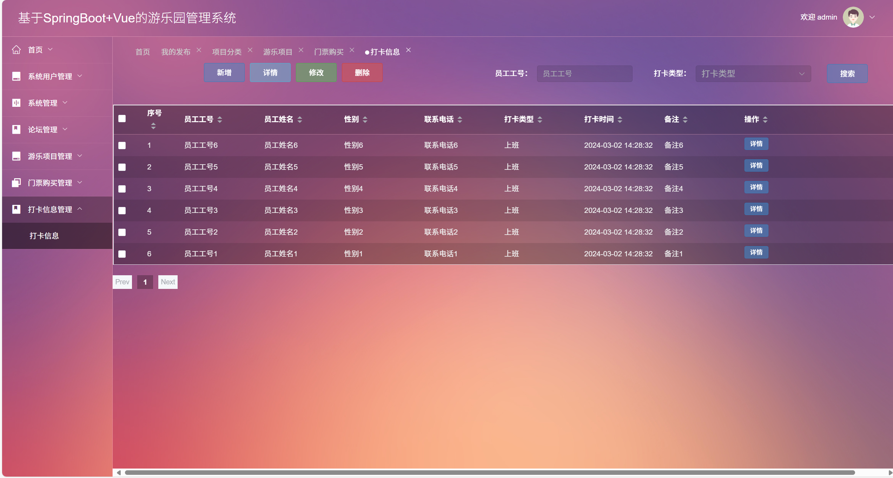

# springbootA544
springbootA544游乐园管理系统（Vue3）
 
## 源码问题查看主页咨询

### 一、关键词
游乐园管理系统，主题公园管理系统，游乐园游客管理系统

### 二、作品包含
源码+数据库+全套环境和工具资源+本地部署教程

### 三、项目技术
前端技术：Html、Css、Js、Vue3.0、Element-plus
后端技术：Java、SpringBoot2.0、MyBatis

### 四、运行环境（以下版本亲测，其他版本兼容性请自行测试）
开发工具：IDEA/eclipse  + VSCODE

数据库：MySQL5.7（最低要5.7版本）

数据库管理工具：Navicat10以上版本

环境配置软件： JDK1.8 + Maven3.6.3

前端Nodejs：16

浏览器：谷歌浏览器

### 五、项目介绍
项目编号：springbootA544

游乐园管理系统能整合票务、客流、设备、消费等核心环节，实现运营高效化、管理数字化与服务精准化。
该游乐园管理系统具有以下功能：
论坛管理：实现帖子的新增、修改、删除及评论查看等论坛交流管理。
游乐项目管理：对游乐项目的分类、信息（名称、开放时间、价格等）进行新增、修改、删除和详情查看。
门票购买管理：管理门票的购买信息，包括项目名称、价格、购买时间、用户信息及支付状态等。
打卡信息管理：对员工打卡信息（工号、姓名、打卡时间、类型等）进行新增、修改、删除和详情查看。
系统用户管理：管理系统用户账号等信息。
系统管理：进行系统相关配置等管理操作。
个人中心：用户可进行个人信息更新、密码修改、论坛管理及门票购买管理等操作。

### 六、运行截图

 
